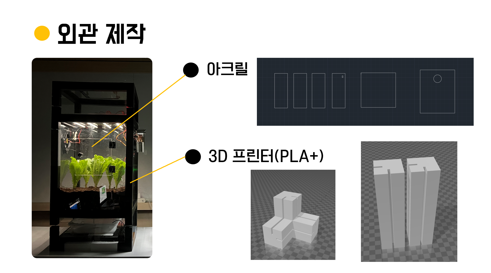
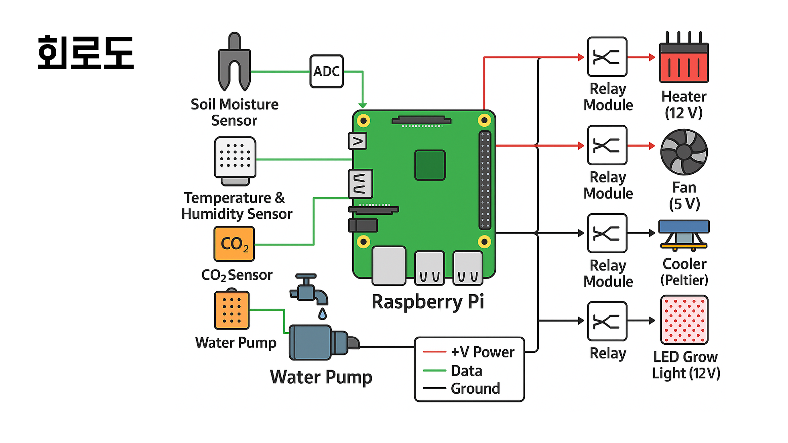
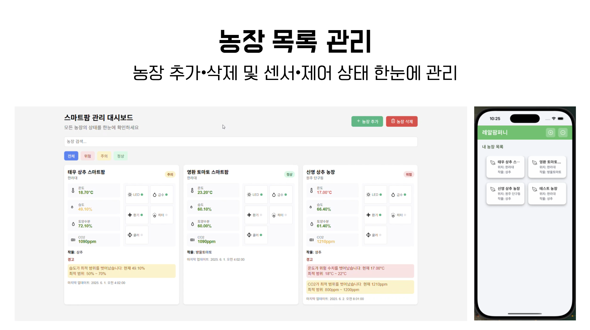
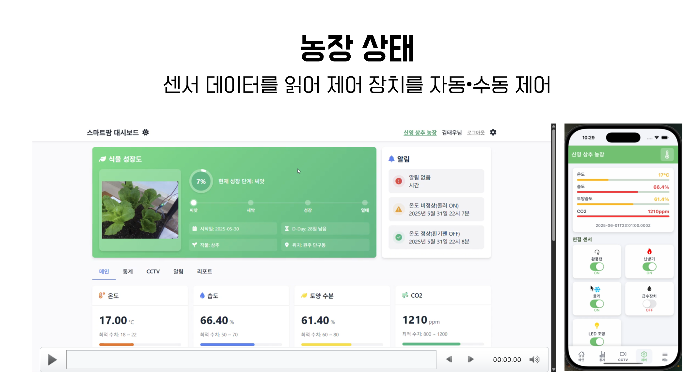
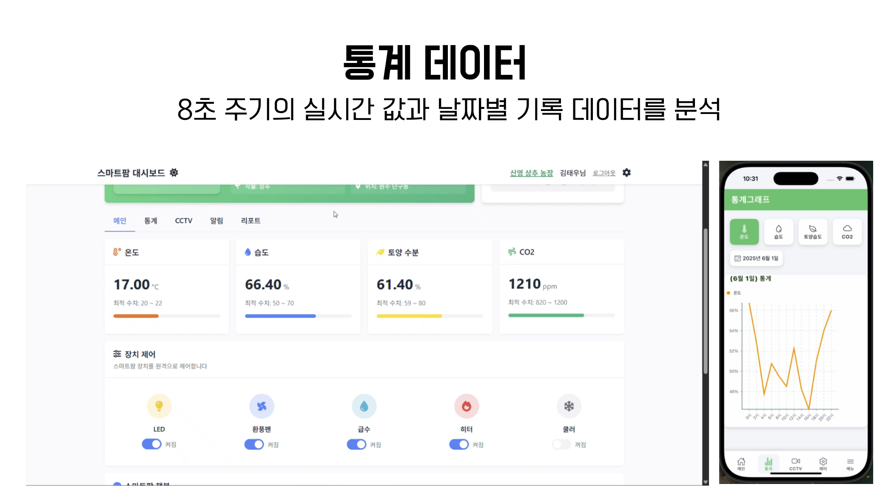
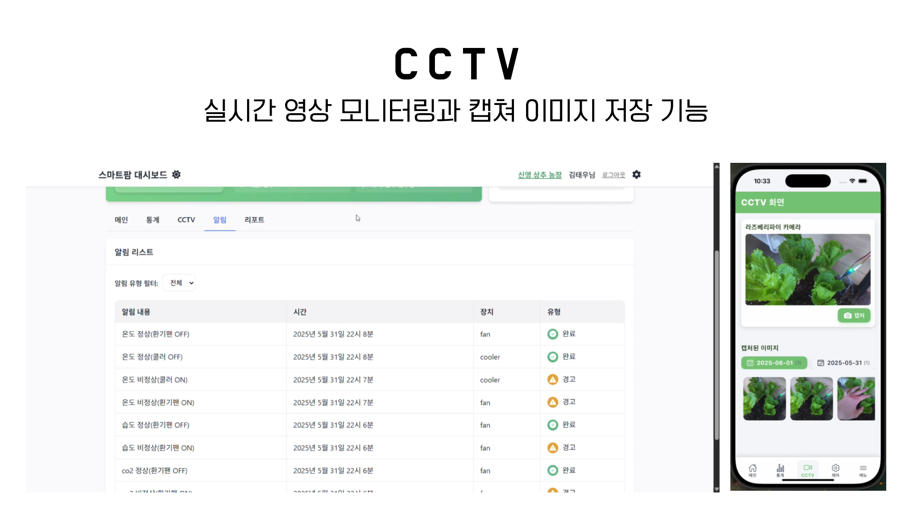
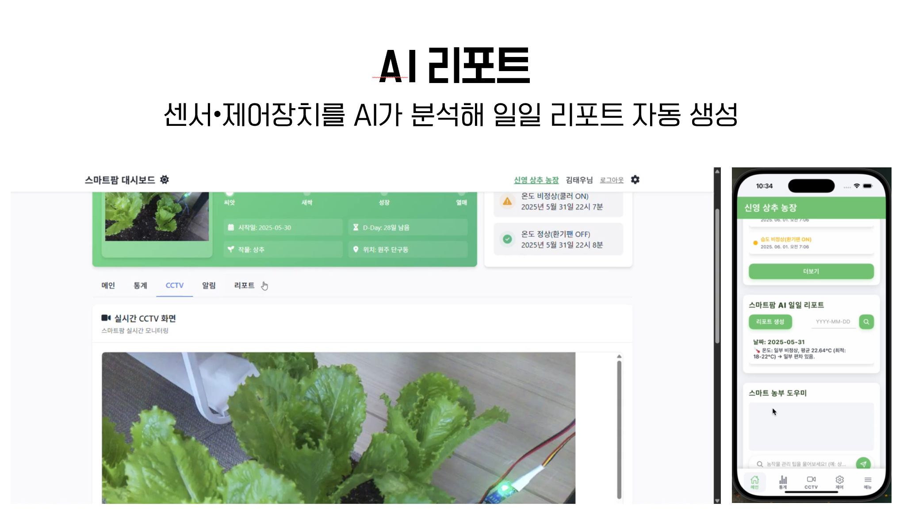
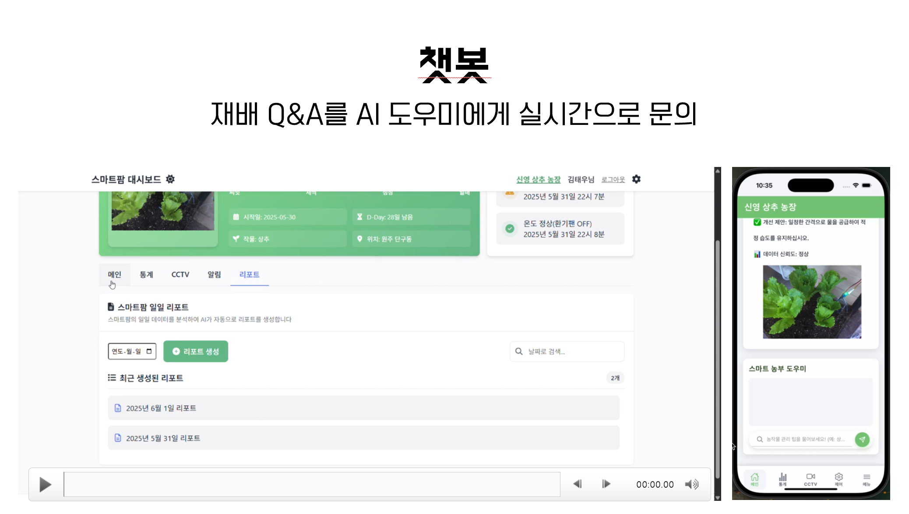

# AI 기법을 활용한 중앙 제어형 스마트팜 시스템   Centrally Controlled Smart Farm using Artificial Intelligence   - RealFarmpany -

### 스마트팜의 문제점?
- **통합 관리의 부재** : 여러 농장을 각각 따로 관리해야 함.   → 여러 농장을 따로 관리하는 인력/시스템 비용 지출이 발생.
- **수집된 데이터 활용 부족** : 데이터를 단순 수집 및 저장, 활용 미흡   → 데이터를 활용한 정보 전달, 활용 부족.

### AI 기법을 활용한 중앙 집중형 스마트팜 시스템
- 여러 스마트팜의 데이터를 중앙 서버에서 집중적으로 통합 관리합니다.
- 수집된 하루 동안의 데이터를 바탕으로 AI가 일일 리포트를 생성합니다.

   

# 프로젝트 개요 
저희 스마트팜 시스템은 가장 기본적인 IoT를 위한 하드웨어, 백엔드, 프론트엔드로 구성되어 있습니다. 프론트엔드는 넓은 화면으로 정보를 한 눈에 볼 수 있는 웹과 어디서든 현재 스마트팜의 상태를 확인 및 관리할 수 있는 앱, 두 가지를 사용합니다.

- 시스템
- 하드웨어
- 웹 & 앱

## System Structure

- **H/W**   4가지의 센서와 5가지 장치를 제어합니다. 온도•습도•토양수분•CO2 값을 센서를 통해 측정하고 api를 통해 중앙 서버로 전송합니다. 또한 측정된 센서값에 따라 급수장치, 환기팬, 쿨러, 히터, LED를 자동 제어 합니다. 웹 또는 앱에서 제어 장치 상태를 변경하는 신호를 보내면 라즈베리파이의 fastapi 서버의 api를 통해 신호를 받고 제어장치 상태를 수동 제어상태로 변경시킵니다. 또한 라즈베리파이 카메라를 이용하여 실시간 스마트팜 상태를 웹 서버를 통해 송출합니다.
- **Frontend**   앞서 말했듯 프론트엔드는 Web과 App으로 구성되어 있고 App은 크로스 플랫폼에서 제작하여 IOS, Android 모두 호환됩니다.
- **Backend**   중앙 서버에서 라즈베리파이와 프론트를 연결하고 DB의 데이터를 바탕으로 Open AI를 활용하여 리포트를 작성합니다.

 

## System Architecture

- **WEB** : 가장 기본 구성인 HTML, CSS, JS를 사용하였습니다. (Windows 환경 개발)
- **APP** : 크로스 플랫폼 React Native에서 TypeScript를 사용하였습니다. (MacOS 환경 개발)
- **Server** : node.js 기반 서버를 구성하였습니다.
- **Database** : Maria DB를 사용하였고 CCTV 캡쳐 화면의 경우 Firebase에 이미지를 저장하였습니다.
- **AI** : Open AI(GPT-4)를 사용하였습니다.
- **배포** : (웹/백엔드)cloudtype에 서버와 데이터베이스 스크립트가 저장된 깃허브를 연결하여 배포하였습니다.
- **Hardware** : 라즈베리파이를 사용하여 하드웨어를 구성하였고 Python을 사용하였습니다. (Rasbian blue-warm 환경 개발)   CCTV 화면을 웹 서버에 배포하기 위해 CloudFlare를 터미널로 활용하였습니다.

 

## Hardware (Prototype)
- 모델링 도구 : MS의 3D Builder
- 제작 도구 : Cubicon style+, Cubicon Single, Laser Cutter

 

- 간단한 그림으로 도식화한 회로도 입니다.

 

 

## Frontend (Prototype)

